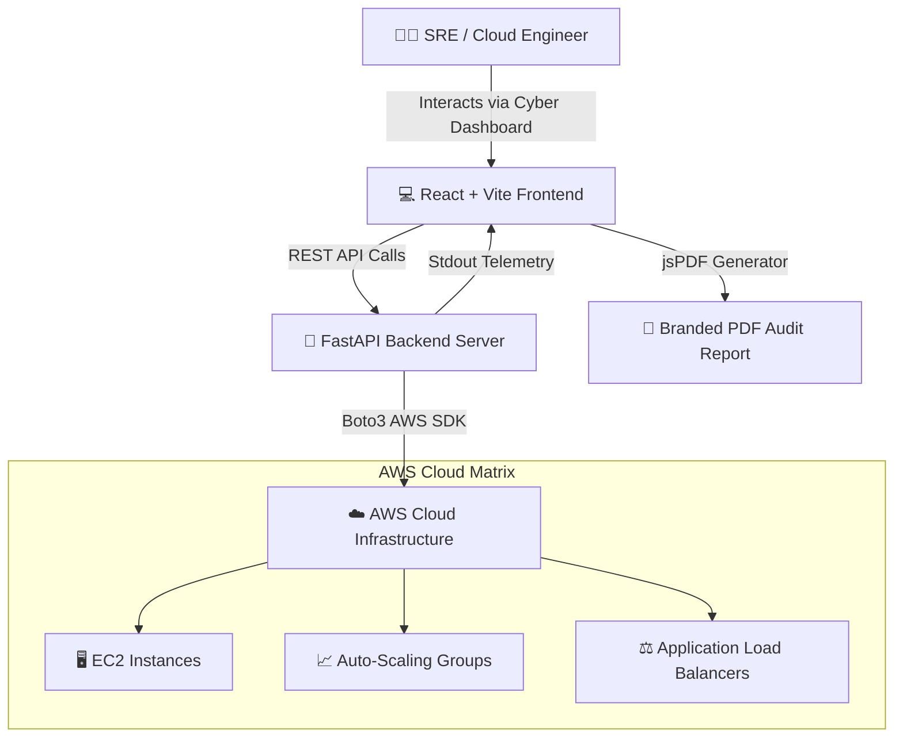

<div align="center">

# ⚡ CloudSentinel
### Autonomous AWS Cloud Resilience & Chaos Engineering Platform

[](https://aws.amazon.com/)
[](https://fastapi.tiangolo.com/)
[](https://reactjs.org/)
[](https://vitejs.dev/)
[](https://opensource.org/licenses/MIT)

*An executive-grade cloud reliability testing platform designed to simulate fault injection scenarios, monitor real-time infrastructure telemetry, and export branded forensic PDF audit reports.*

</div>

---

## 🌟 Executive Overview

**CloudSentinel** empowers DevOps, SRE, and Cloud Security engineers to continuously validate AWS cloud resilience. By executing controlled chaos injection experiments (such as EC2 instance failure, Auto Scaling Group stress, API Gateway latency, and ALB ingress disruptions), CloudSentinel identifies failure points before they impact production workloads.

---

## 🚀 Key Features

### 🛡️ Autonomous Chaos Injection Engine
- **AWS Guard Confirmation Lock**: Prevents accidental triggers with safety confirmation toggles.
- **Scenario Suite**: Pre-configured resilience test cases targeting EC2, Auto-Scaling Groups, Application Load Balancers, and VPC Network topologies.
- **Real-Time Fault Monitoring**: Tracks execution status, stdout logs, pass/fail metrics, and auto-recovery rates.

### 🌌 Modern Cyber-Tech Dashboard UI
- **Cyber Constellation Matrix**: Particle canvas background with dynamic topology node connections and real-time laser pulse streams during active fault injection.
- **Multi-Theme Engine**: Switch seamlessly between **Cyber Neon** (Electric Cyan), **Quantum Gold** (Amber), **Matrix Emerald** (Green), and **Crimson Alert** (Red).
- **AWS Infrastructure Topology Deck**: Visual interactive map illustrating nodes, region endpoints (`ap-south-1`), and active chaos propagation.

### 📊 Executive PDF Audit Reporting
- **Single Run Reports**: Branded single-click PDF export containing test metadata, step logs, severity ratings, and resolution steps.
- **Master Audit Suite Report**: Executive-level PDF report summarizing total execution runs, overall pass/fail percentage, success rates, and full audit ledger breakdowns.

### 📡 Live Cyber Terminal
- **Stdout Streaming**: Real-time console log viewer with granular filter buttons (`ALL`, `INFO`, `WARN`, `ERROR`).
- **Precision Log Actions**: One-click log copying and custom log level inspection.

---

## 🏗️ System Architecture



---

## 💻 Tech Stack

- **Frontend**: React 18, Vite 6, Lucide Icons, jsPDF, html2canvas, Canvas API
- **Backend**: Python 3.10+, FastAPI, Uvicorn, Pydantic, Boto3 (AWS SDK)
- **Styling**: Cyberpunk Dark-mode Design System (Vanilla CSS with CSS Variables)

---

## ⚡ Quick Start Guide

### Prerequisites
- Python 3.10+
- Node.js 18+ and npm
- AWS CLI configured with active IAM access credentials

### 1️⃣ Clone the Repository
```bash
git clone https://github.com/Manthann07/CloudSentinal.git
cd CloudSentinal
```

### 2️⃣ Backend Setup
```bash
# Navigate to backend
cd backend

# Create virtual environment
python -m venv .venv

# Activate virtual environment (Windows PowerShell)
.\.venv\Scripts\Activate.ps1

# Install backend dependencies
pip install -r requirements.txt

# Configure environment variables
cp .env.example .env
```

> **Note**: Update your `backend/.env` with your AWS credentials:
> ```env
> AWS_ACCESS_KEY_ID=your_access_key
> AWS_SECRET_ACCESS_KEY=your_secret_key
> AWS_REGION=ap-south-1
> ```

Test AWS Connectivity:
```bash
python check_aws_connection.py
```

Start FastAPI Backend:
```bash
python -m uvicorn main:app --reload --port 8000
```
*API Swagger Documentation will be available at `http://127.0.0.1:8000/docs`*

### 3️⃣ Frontend Setup
```bash
# Open a new terminal window and navigate to frontend
cd frontend

# Install dependencies
npm install

# Start Vite Dev Server
npm run dev
```
*Access the Cyber Dashboard at `http://localhost:5173`*

---

## 📄 API Documentation

| Method | Endpoint | Description |
| :--- | :--- | :--- |
| `GET` | `/api/health` | Backend API health & AWS connectivity check |
| `GET` | `/api/tests` | Fetch available AWS chaos test suites |
| `POST` | `/api/run-test` | Trigger chaos injection (`{ "test_name": "ec2_termination", "confirm": true }`) |
| `GET` | `/api/runs` | Retrieve execution ledger run history |
| `GET` | `/api/report/{run_id}` | Fetch intelligence report for a specific test run |

---

## 🤝 Contributing

Contributions are welcome! Please follow these steps:
1. Fork the Repository
2. Create your Feature Branch (`git checkout -b feature/AmazingFeature`)
3. Commit your Changes (`git commit -m 'Add some AmazingFeature'`)
4. Push to the Branch (`git push origin feature/AmazingFeature`)
5. Open a Pull Request

---

## 📝 License

Distributed under the **MIT License**. See `LICENSE` for more information.

---

<div align="center">
  <sub>Built with ❤️ for Cloud Resilience Engineering by <strong>CloudSentinel Team</strong></sub>
</div>
